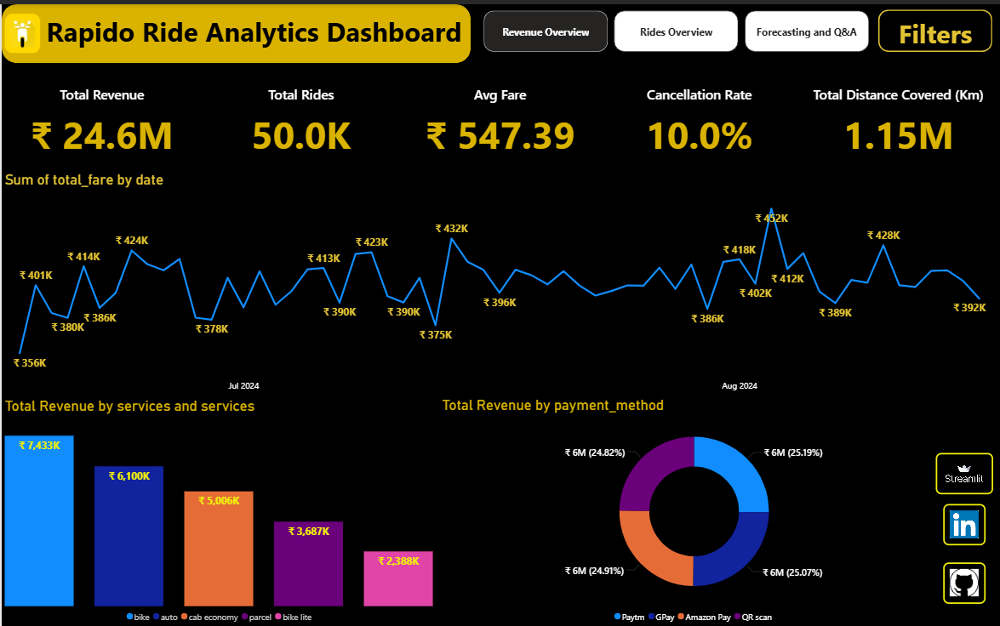
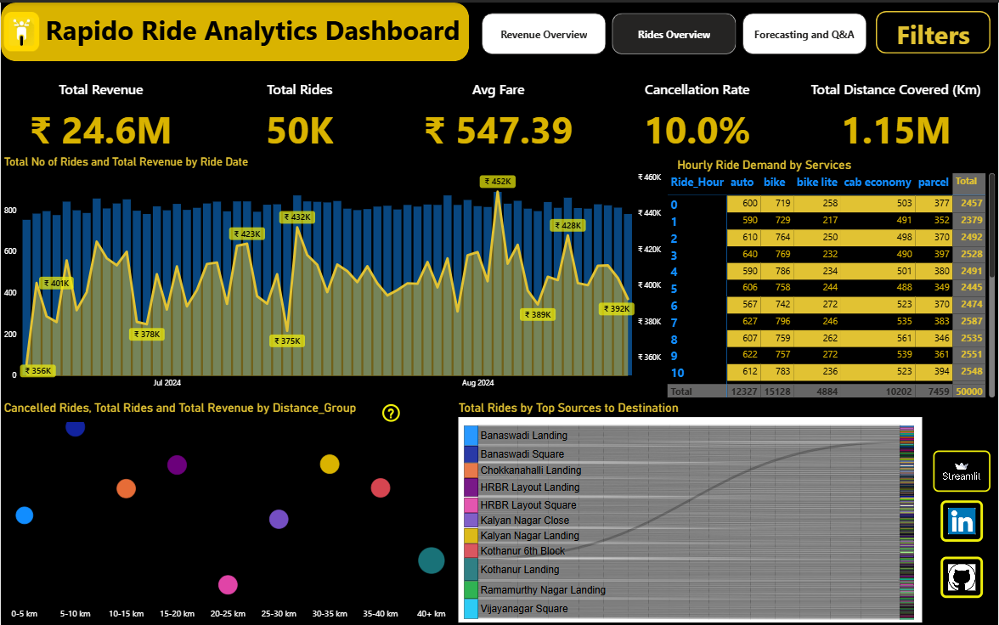
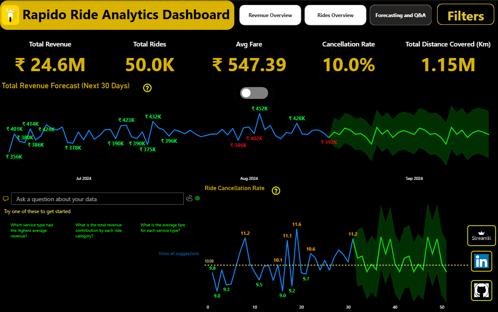

🚀 RAPIDO BANGALORE RIDES ANALYSIS

PROJECT OVERVIEW
This project provides an in-depth analysis of Rapido ride bookings in Bangalore using a combination of SQL, Python, and Power BI. The goal is to uncover key insights into revenue trends, ride demand, customer behavior, and future forecasting. This analysis helps in strategic decision-making, optimizing ride allocation, and improving customer experience.

TECHNOLOGIES USED

1️⃣ SQL (MySQL)
- Data Extraction & Transformation:
  - Imported the Rapido ride dataset into MySQL.
  - Cleaned and structured the data for better analysis.
  - Used joins, aggregations, and filtering to derive insights.
- Key Queries Used:
  - Extracted monthly and yearly ride counts.
  - Identified the top revenue-generating locations.
  - Determined peak ride hours to optimize driver allocation.

2️⃣ Python (Pandas, Matplotlib, Prophet, Plotly, Streamlit)
- Data Preprocessing:
  - Handled missing values and formatted date-time fields.
  - Merged different datasets for a comprehensive view.
- Exploratory Data Analysis (EDA):
  - Identified customer behavior patterns using Python’s Pandas library.
  - Visualized revenue and ride trends with Matplotlib, Seaborn, and Plotly.
- Forecasting with Facebook Prophet:
  - Implemented Prophet to predict future ride demand and revenue.
  - Evaluated forecast accuracy and adjusted model parameters.
- Streamlit Deployment:
  - Built an interactive web application using Streamlit.
  - Hosted the dashboard on Streamlit Cloud for easy accessibility.

3️⃣ Power BI (Data Visualization & Dashboarding)
- Dashboard Creation:
  - Built interactive dashboards for real-time insights.
  - Used DAX functions for custom calculations and trend analysis.
- Key Visualizations:
  - Revenue Overview: Displays total revenue trends and area-wise revenue generation.
  - Rides Overview: Analyzes ride patterns, peak hours, and customer segmentation.
  - Forecasting Section: Predicts future rides and revenue using historical data.
- Power BI Q&A:
  - Enabled dynamic question-based insights using Power BI’s Q&A feature.
  - Allows business stakeholders to get answers instantly.

POWER BI DASHBOARDS

1️⃣ Revenue Overview
- Displays insights into total revenue, monthly trends, and top revenue-generating areas.
- Helps Rapido optimize pricing strategies and boost revenue streams.

2️⃣ Rides Overview
- Analyzes total rides, peak hours, and customer segmentation.  
- Provides actionable insights to improve customer satisfaction.

3️⃣ Forecasting & Q&A Section
- Forecasts future rides & revenue using historical data.
- Enables interactive Q&A for business decision-making.

HOW TO USE THIS ANALYSIS
1. Explore the Power BI dashboards for deep insights into revenue, rides, and future trends.
2. Use SQL queries to extract custom insights based on business needs.
3. Leverage Python scripts for advanced forecasting and data-driven strategies.
4. Access the Streamlit app for interactive data exploration and visualization.

PROJECT LINKS
- GitHub Repository: [Rapido Bookings Analysis](https://github.com/MallikarjunaReddy448/Rapido-Bookings-Analysis)
- Power BI Dashboard: [Rapido Bangalore Rides](https://app.powerbi.com/view?r=eyJrIjoiZGQxNDhlOGYtZDhjOS00YjdiLTkzM2UtMjljZTM0ODRhM2EyIiwidCI6ImQ3NDEyYTBjLTU0ODAtNDMzMS1hNzRjLTVkNWZhYjk3NjQ2OSJ9)
- Streamlit App: [Rapido Interactive Dashboard](https://mallikarjunareddy448-rapid-streamlit-dashboardrapido-app-lmmds4.streamlit.app/)

🚀 This project provides actionable insights to optimize Rapido's operations in Bangalore. Let me know if you need any further improvements! 😊
